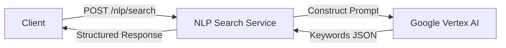

# NLP Search Service

This microservice provides an intelligent search capability by extracting keywords and synonyms from natural language queries using Google Cloud Vertex AI (Gemini). It transforms user intent into structured search terms to improve search relevance.

## Features

- **Keyword Extraction**: Identifies core concepts and keywords from natural language input.
- **Synonym Generation**: (Optional) Enriches keywords with synonyms to broaden search coverage.
- **Vertex AI Integration**: Leverages Google's Generative AI models for high-quality understanding.
- **FastAPI**: built on a modern, high-performance web framework.
- **Docker Ready**: Fully containerized for easy deployment.

## Architecture



## Prerequisites

- **Python 3.10+** (if running locally)
- **Google Cloud Platform (GCP) Project** with Vertex AI API enabled.
- **Service Account** credentials with permissions to invoke Vertex AI models.

## Installation

1.  Clone the repository.
2.  Install dependencies:

    ```bash
    pip install -r requirements.txt
    ```

## Configuration

The application is configured via environment variables. Create a `.env` file in the root directory with the following keys:

| Variable | Description | Example |
| :--- | :--- | :--- |
| `project` | GCP Project ID | `my-gcp-project-id` |
| `location` | GCP Region for Vertex AI | `asia-south1` |
| `model` | Vertex AI Generative Model Name | `gemini-2.5-flash` |
| `PROMPT_VERSION` | Version of the prompt to use | `latest` or `v1` |
| `GOOGLE_APPLICATION_CREDENTIALS` | Path to Service Account JSON key | `creds/service-account.json` |

| `max_output_tokens` | Max tokens for generation | `1024` |
| `temperature` | LLM Temperature (creativity) | `0.1` |
| `top_p` | Nucleus sampling parameter | `0.9` |
| `top_k` | Top-K sampling parameter | `40` |
| `max_search_len` | Maximum allowed query length | `200` |

### Credentials
Place your Google Cloud Service Account JSON key file in the `creds/` directory (or wherever `GOOGLE_APPLICATION_CREDENTIALS` points to).

## Running the Service

### Local Development

Run the service using Uvicorn with hot-reloading enabled:

```bash
uvicorn src.main:app --reload
```

The API will be available at `http://localhost:8000`.
Interactive API documentation (Swagger UI) is available at `http://localhost:8000/docs`.

### Testing Locally

You can test the API using `curl`:

```bash
curl -X 'POST' \
  'http://localhost:8000/nlp/search' \
  -H 'accept: application/json' \
  -H 'Content-Type: application/json' \
  -d '{
  "query": "machines that learn from data",
  "synonyms": true
}'
```

### Docker

1.  **Build the image:**

    ```bash
    docker build -t nlp-search .
    ```

2.  **Run the container:**

    Ensure you mount the credentials volume if using a file path.

    ```bash
    docker run -p 8000:8000 --env-file .env -v $(pwd)/creds:/app/creds nlp-search:latest
    ```

## API Usage

### Extract Keywords

**Endpoint:** `POST /nlp/search`

**Request Body:**

```json
{
  "query": "machines that learn from data",
  "synonyms": true
}
```

- `query` (string): The natural language search query.
- `synonyms` (boolean): Whether to include synonyms for the extracted keywords.

**Response Example:**

```json
{
  "data": {
    "keywords": ["machine learning", "data"],
    "synonyms": ["ML", "artificial intelligence", "datasets"]
  }
}
```

## Project Structure

- `src/`
    - `main.py`: Entry point for the FastAPI application.
    - `config.py`: Pydantic settings and checking environment variables.
    - `search/`: Core module.
        - `router.py`: Defines API endpoints.
        - `llm_service.py`: Handles logic and communication with Vertex AI.
        - `request_model.py`: Defines the input data schema.
- `Dockerfile`: Container definition.
- `Jenkinsfile`: CI/CD pipeline configuration.
- `requirements.txt`: Python dependencies.
